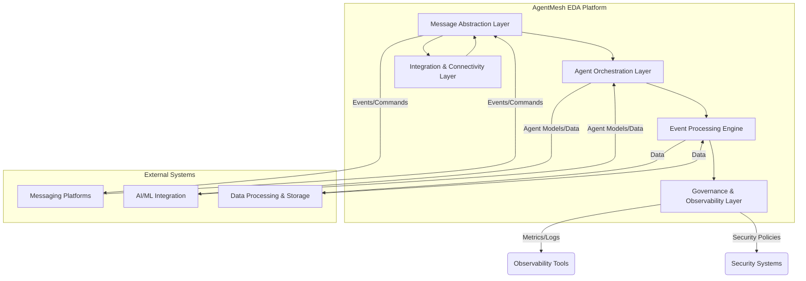

# AgentMesh EDA

Event-Driven Architecture for Agentic AI.

## Overview

The AgentMesh EDA (Event-Driven Architecture) is a comprehensive framework designed for building scalable, resilient, and intelligent Agentic AI systems. It provides unified abstractions for multiple messaging systems, enabling seamless coordination of AI agents through real-time event processing, dynamic routing, and autonomous decision-making capabilities.

### Key Features:

*   **Multi-Tenancy:** Supports isolated operations for multiple tenants, ensuring data and operational segregation.
*   **Message Abstraction Layer (MAL):** Provides a unified interface for various messaging systems (NATS, Kafka, etc.) with intelligent routing and message persistence.
*   **Agent Orchestration Layer (AOL):** Manages agent lifecycle, coordination, and supports various multi-agent patterns (Orchestrator-Worker, Hierarchical, Blackboard, Market-Based).
*   **Event Processing Engine (EPE):** Includes components for anomaly detection and performance optimization.
*   **Command Query Responsibility Segregation (CQRS):** Implements CQRS for efficient data handling.
*   **Robust Tooling:** Features a command-line interface (CLI) for system management and a web-based UI for monitoring.
*   **Persistent Storage:** Integrates with PostgreSQL for reliable data storage.
*   **CI/CD Pipeline:** Basic GitHub Actions workflow for automated build and test.

## Architecture

The AgentMesh EDA is built on a layered architecture, comprising:

*   **Message Abstraction Layer (MAL):** Handles universal message formatting, multi-protocol support, dynamic routing, and message persistence.
*   **Agent Orchestration Layer (AOL):** Manages agent registration, discovery, and coordination patterns.
*   **Event Processing Engine (EPE):** Focuses on real-time event processing, anomaly detection, and performance analytics.
*   **Integration & Connectivity Layer (ICL):** (Conceptual, to be expanded) Facilitates integration with external systems.
*   **Governance & Observability Layer (GOL):** Provides monitoring, security, and governance capabilities.



## Getting Started

This section provides instructions on how to set up and use the AgentMesh EDA solution.

### Prerequisites

*   **Docker** and **Docker Compose**: Ensure Docker Desktop is installed and running.
*   **Python 3.9+** and `pip` (or `poetry` if preferred for dependency management).

### Clone the Repository

```bash
git clone <repository_url>
cd agentmesh-eda
```

### Build and Run Docker Containers

The project uses Docker Compose to manage its services, including the AgentMesh application, a NATS messaging server, and a PostgreSQL database.

```bash
docker-compose up --build -d
```

This command will:

*   Build the `agentmesh` Docker image.
*   Start the `agentmesh` container.
*   Start the `nats` messaging server container.
*   Start the `postgres` database container.

You can check the status of the running containers with `docker-compose ps`.

## Usage

### Using the CLI

The AgentMesh EDA CLI tool allows you to interact with the system from your terminal. You can execute CLI commands using `docker-compose exec agentmesh python -m agentmesh.cli.main <command>`.

**Examples:**

1.  **Create a new tenant:**

    ```bash
    docker-compose exec agentmesh python -m agentmesh.cli.main tenant create mytenant
    ```

2.  **List all tenants:**

    ```bash
    docker-compose exec agentmesh python -m agentmesh.cli.main tenant list
    ```

3.  **Check system status:**

    ```bash
    docker-compose exec agentmesh python -m agentmesh.cli.main status
    ```

4.  **View a message by ID:**

    ```bash
    docker-compose exec agentmesh python -m agentmesh.cli.main message view <message_id>
    ```

5.  **Start a simple agent:**

    ```bash
    docker-compose exec -d agentmesh python -m agentmesh.cli.main agent start simple-agent-1 --capabilities "process-data"
    ```

6.  **Start a Task Executor Agent:**

    ```bash
    docker-compose exec -d agentmesh python -m agentmesh.cli.main agent start-task-executor task-exec-agent-1 --capabilities "execute-tasks"
    ```

7.  **Start an Orchestrator Agent and assign a task:**

    ```bash
    docker-compose exec agentmesh python -m agentmesh.cli.main agent start-orchestrator orchestrator-1 --capabilities "orchestrate" --tenant-id "mytenant" --target-agent-id "task-exec-agent-1" --task-details '{"type": "process_file", "file_name": "report.pdf"}'
    ```

8.  **Start a Kafka Agent:**

    ```bash
    docker-compose exec -d agentmesh python -m agentmesh.cli.main agent start-kafka-agent kafka-agent-1 --capabilities "kafka-consumer"
    ```

### Using the UI

The AgentMesh EDA provides a simple web-based user interface for monitoring and managing the system.

1.  **Access the UI:**

    Once the Docker containers are running, you can access the UI in your web browser at:

    `http://localhost:5000`

2.  **Available Pages:**

    *   **Home (`/`):** Provides links to other sections of the UI.
    *   **Tenants (`/tenants`):** View existing tenants and create new ones.
    *   **System Status (`/status`):** Check the overall health of the system.
    *   **Messages (`/messages`):** View messages processed by the system.

## Development

This project uses Poetry for dependency management.

1.  Install Poetry: `pip install poetry`
2.  Install dependencies: `poetry install`
3.  Run tests: `poetry run pytest`

## Future Enhancements

*   Implement more sophisticated anomaly detection and performance optimization algorithms.
*   Expand the Integration & Connectivity Layer with more connectors and API gateways.
*   Implement comprehensive security features (RBAC, encryption, identity management).
*   Develop more advanced multi-agent system patterns.
*   Integrate with real-time stream processing frameworks for complex event processing.
*   Automate deployments with a robust CI/CD pipeline.